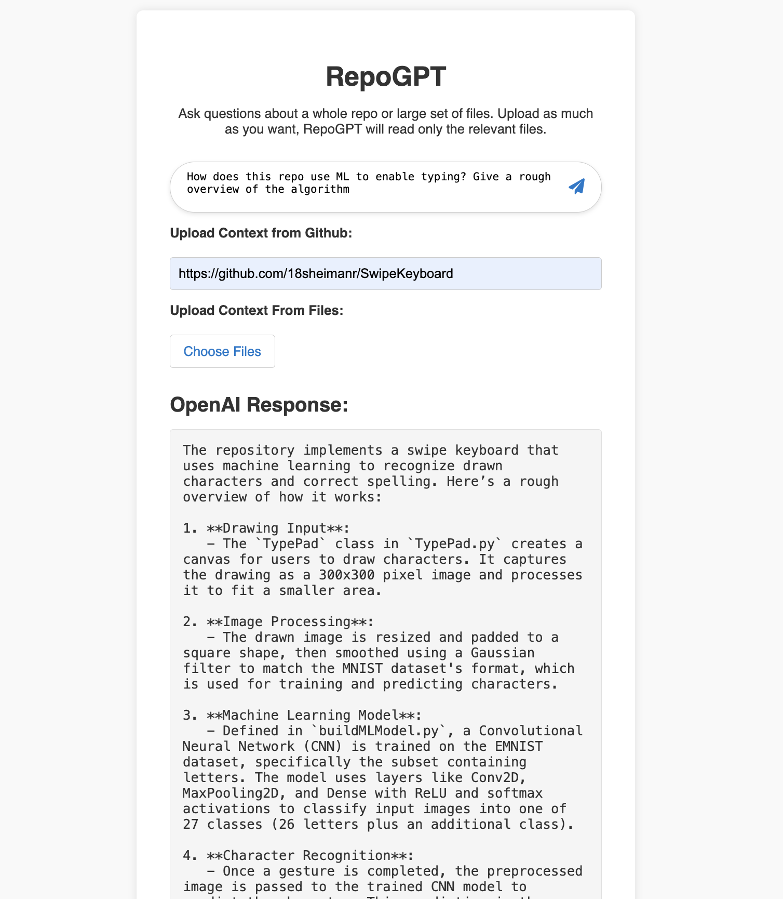

# RepoGPT

RepoGPT uses LLMs lets you chat with an entire repo, uninhibited by file upload limits of OpenAI/Anthropic. It simplifies codebase exploration and management, providing intelligent insights to make development more efficient.

## Features

**Efficient LLM Context**: RepoGPT examines the repo file tree and your query to grab only relevant files
**Caching and Efficient Fetching**: Downloads and caches files from whitelisted extensions only IE py, js, ts.

### Usage

1. clone repo
2. Set your OPENAI_API_KEY in index.html on L51
3. Set your GITHUB_TOKEN in index.html on L50
4. Edit acceptedExtensions on to include the file types you want to search
5. Open index.html in a browser